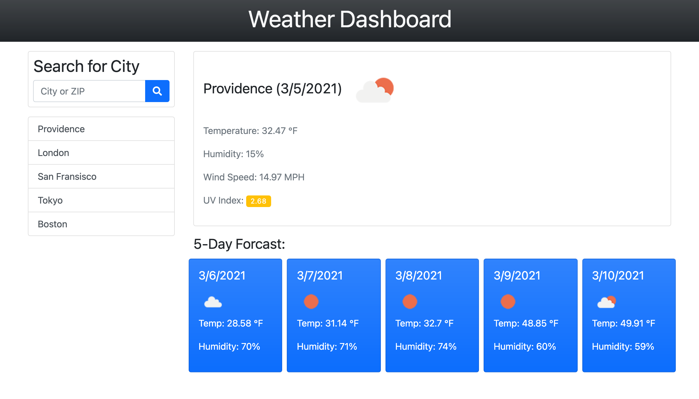

# Weather Dashboard

## Description 

A simple weather dashboard that allows the user to search for a city by name or ZIP code, and displays the current weather and a five-day forecast for the searched location. The last 5 searches are stored in a list and can be easily recalled by clicking on the list item.

## Usage

[Deployed Link](https://ghall89.github.io/weather-dashboard/)

## Frameworks
* [Bootstrap](https://getbootstrap.com/)
* [FontAwesome](https://fontawesome.com)
* [OpenWeather API](https://openweathermap.org/api)
* [Moment.js](https://momentjs.com)